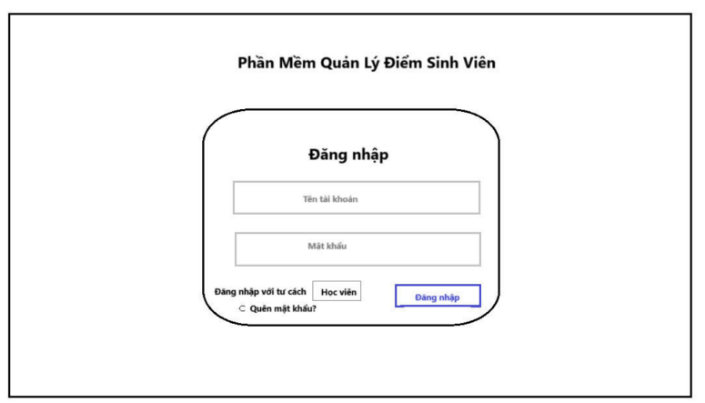
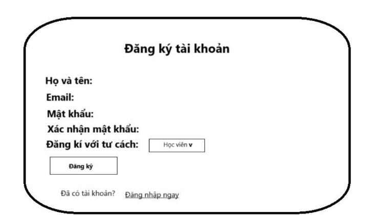
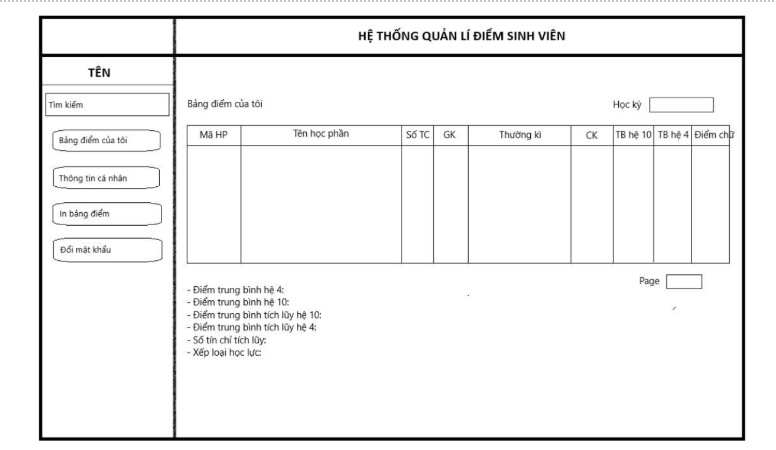
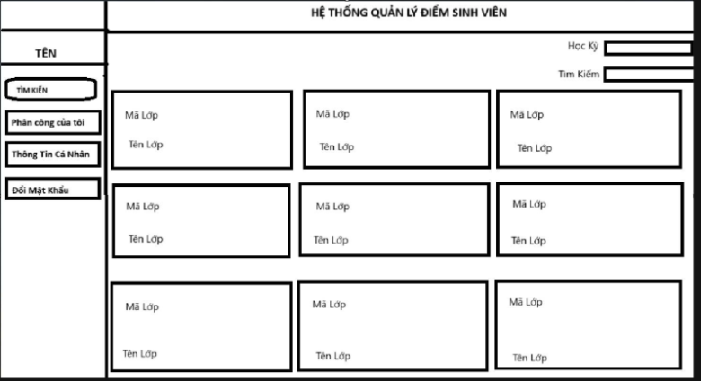
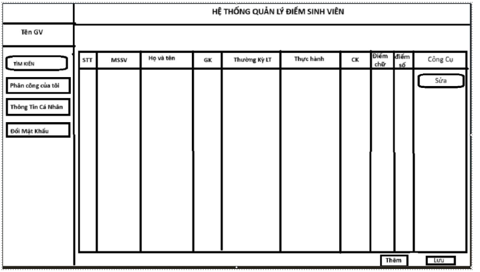
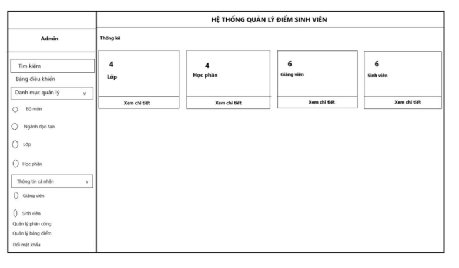

# Score-input proposal

## Thông tin

### Nhóm

- **Thành viên 1**: Mai Thị Diệu My - 22707221
- **Thành viên 2**: Nguyễn Phạm Chí Bảo - 22678881
- **Thành viên 3**: Võ Tấn Bình – 22665691
- **Thành viên 4**: Vũ Hải Ninh - 22001485

### Git repository:

[Repository Link](#)

---

## Ý tưởng

### Minimum Viable Product

_Ý tưởng sản phẩm dùng để demo_

Hoàn thiện được ứng dụng web để giáo viên có thể quản lý tương tác với điểm của sinh viên, có thể sửa chữa điểm của từng sinh viên.

### Complete Product

_Ý tưởng sản phẩm nhóm hướng đến_

Tối ưu hóa việc nhập và sửa điểm bằng cách đẩy file Excel bảng điểm một lần và map với ID sinh viên để tự động điền điểm, giúp tiết kiệm thời gian.

---

## Phân Tích & Thiết Kế

### Chức năng

#### **User: Giáo viên**

- Quản lý điểm (_Tạo, đọc, xóa, cập nhật - CRUD_)
- Thay đổi mật khẩu

#### **Admin: Quản lý người dùng**

- **Read**: Xem thông tin người dùng
- **Update**: Reset mật khẩu của người dùng
- **Thay đổi mật khẩu**
- **Cấp quyền sử dụng**

---

### Lược đồ CSDL

#### **Bảng dữ liệu**

- **Khoa** (_MaKhoa, TenKhoa_)
- **Lớp** (_MaLop, TenLop, MaKhoa, MaGV_)
- **Giáo viên** (_MaGV, TênGV, SĐT, email_)
- **Học sinh** (_MaHS, TênHS, Địa chỉ, SĐT, email_)
- **Học sinh - Lớp** (_MaHS, MaLop_)
- **Môn học** (_MaMH, TenMH, SoTietTH, SoTietLT_)
- **Môn học - Giáo viên** (_MaMH, MaGV_)
- **Môn học - Học sinh** (_MaHS, MaMH, Học kỳ, Năm học_)
- **Điểm** (_MaMH, MaHS, MaGV, Ngày nhập, Điểm số_)

---

## Giao diện

### **Danh sách giao diện (webpage) dự kiến**

- **Đăng nhập**: `register.html`
- **Đăng ký**: `login.html`
- **Trang chủ**: `index.html`
  - **Sinh viên**: Hiển thị GPA và danh sách môn đã học.
  - **Giáo viên**: Hiển thị danh sách môn học phụ trách.
  - **Admin**: Hiển thị tổng quan (số lượng sinh viên, giáo viên).
- **Xem thông tin cá nhân**: `profile.html`
  - **Sinh viên**: Hiển thị ID, họ và tên, email, SĐT.
  - **Giáo viên**: Hiển thị ID, họ và tên, email, SĐT.
- **Xem điểm nhân**: `scores.html`
  - Danh sách điểm của sinh viên (môn học, điểm, học kỳ).
- **Quản lý điểm sinh viên**: `managescores.html`
  - Giáo viên có thể nhập/sửa điểm của sinh viên.
- **Danh sách sinh viên**: `student.html`
  - Hiển thị danh sách sinh viên (ID, họ và tên, lớp) và nút đặt lại mật khẩu.
- **Danh sách giáo viên**: `teachers.html`
  - Hiển thị danh sách giáo viên (ID, họ và tên, lớp) và nút đặt lại mật khẩu.
- **Đặt lại mật khẩu**: `resetpass.html`
  - Đặt lại mật khẩu cho giảng viên, sinh viên và admin.

---

## Thiết kế chi tiết (Wireframe)

- `register.html`

- `login.html`

- `scores.html`

- `managescores.html`

- Trang admin

---

## Kế hoạch thực hiện

| Tuần       | Công việc                                                                     |
| ---------- | ----------------------------------------------------------------------------- |
| **Tuần 1** | Họp nhóm, bàn giao diện, tìm hiểu cơ bản về web                               |
| **Tuần 2** | Bắt đầu thiết kế các giao diện, tạo trang đăng ký, đăng nhập, trang chủ admin |
| **Tuần 3** | Tạo trang chủ giáo viên, học sinh                                             |
| **Tuần 4** | _Công việc tiếp theo_                                                         |
| **Tuần 5** | _Công việc tiếp theo_                                                         |
| **Tuần 6** | Demo sản phẩm                                                                 |

---

## Câu hỏi / Vấn đề

_Liệt kê câu hỏi hoặc vấn đề của nhóm tại đây_
